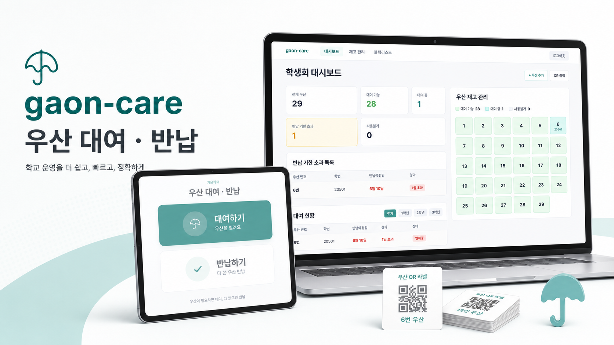
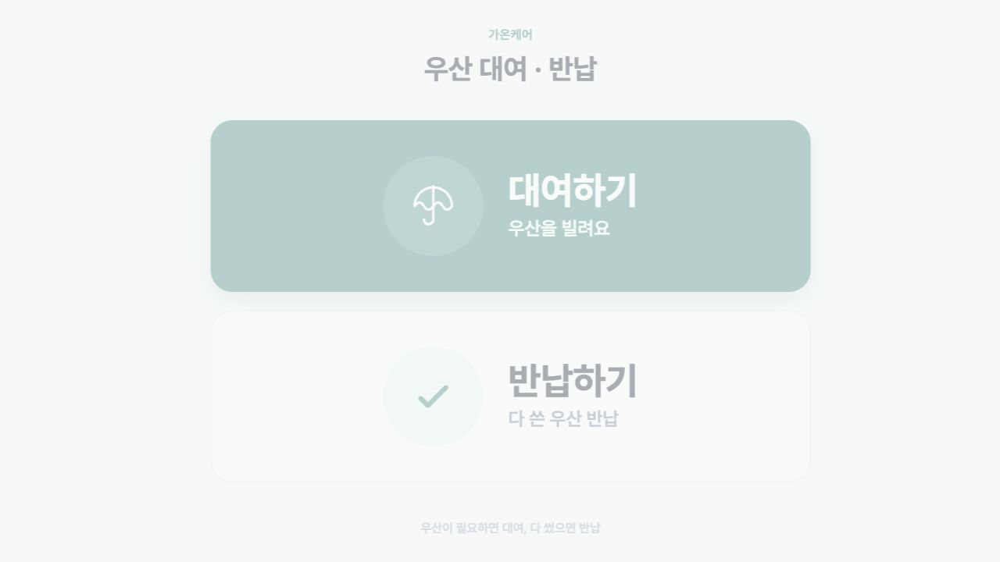
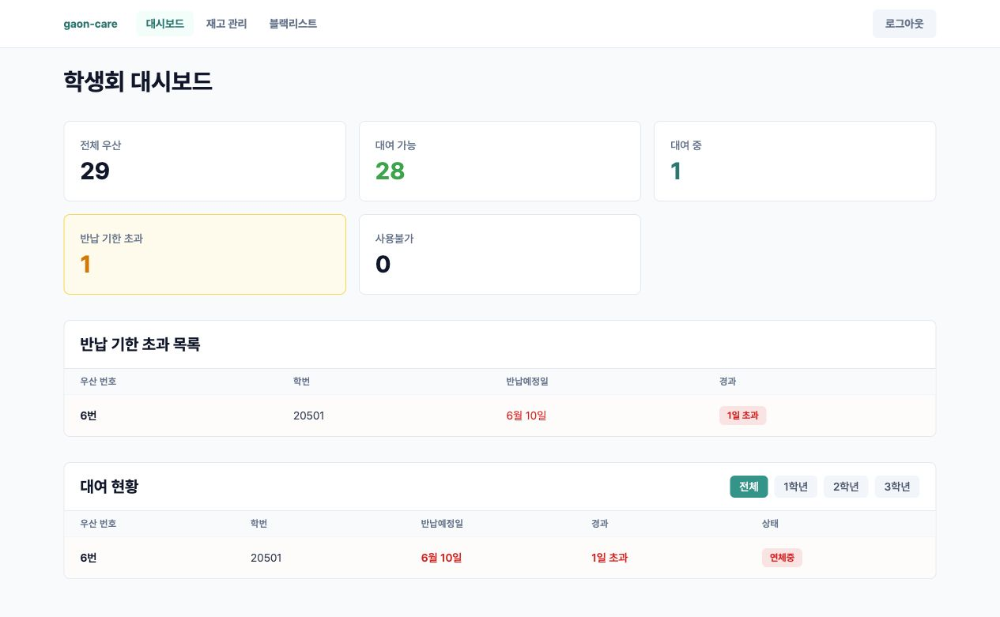
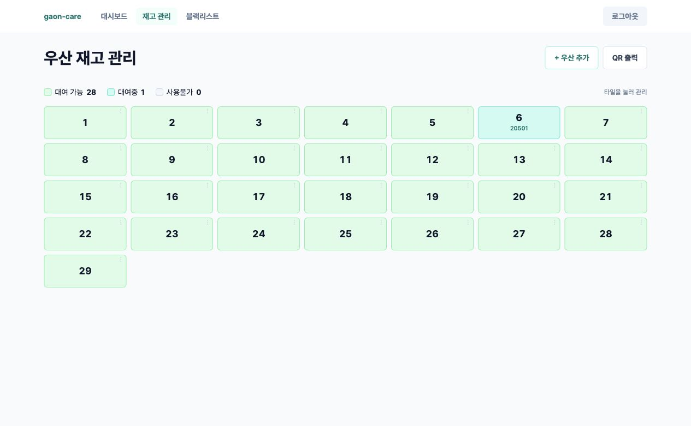
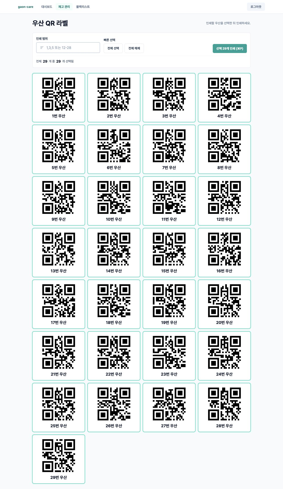
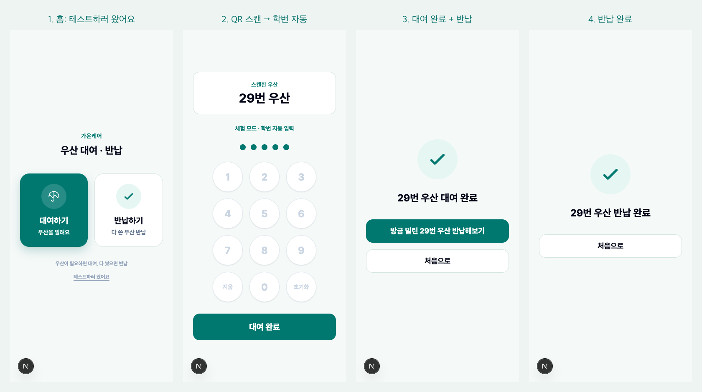

# gaon-care

> 대치중학교 우산 대여를 종이 장부에서 태블릿 FO와 학생회 BO로 바꾸는 운영 MVP

<p>
  
  
  
  
</p>



`gaon-care`는 대치 중학교 학생이 우산에 붙어있는 QR코드를 태블릿에 찍은다음, 자신의 학번을 입력해 대여할 수 있게한 서비스입니다. 
학생회는 백오피스를 통해서 우산 재고, 대여 현황, 반납 기한 초과 우산, QR 라벨 출력을 관리할 수 있습니다. 

## Product Surface

| FO tablet | BO dashboard |
| --- | --- |
|  |  |

| Inventory rack map | Printable QR labels |
| --- | --- |
|  |  |

## Try It (체험 모드)



## Why It Exists

- 종이 장부 대신 QR 기반 기록으로 우산 ID와 학번 형식을 고정합니다.
- 학생은 대여와 반납을 직접 처리하고, 학생회는 현재 상태만 확인하면 됩니다.
- 3일을 넘긴 대여 기록은 자동으로 운영 이슈로 올라옵니다.
- 웹/PWA로 시작해 학교 태블릿에서 URL만 열어 배포할 수 있습니다.

## Core Flow

1. 학생이 `/fo`에서 `대여하기` 또는 `반납하기`를 선택합니다.
2. 우산에 붙은 QR을 스캔합니다.
3. 대여는 5자리 학번을 입력한 뒤 완료됩니다.
4. 반납은 학번 입력 없이 QR 스캔만으로 완료됩니다.
5. 학생회는 `/bo`에서 재고, 대여 중, 연체, 사용불가 상태를 확인합니다.
6. `/bo/umbrellas/print`에서 우산별 QR 라벨을 선택해 출력합니다.

## Features

- Tablet-first FO rental and return flow
- Student council BO dashboard
- Umbrella rack map with status colors
- Printable QR label sheets
- 5-digit student ID validation
- Overdue detection after the return due date
- Manual unavailable / restore / archive operations
- Supabase-backed shared rental state

## Routes

| Route | Purpose |
| --- | --- |
| `/fo` | 학생용 우산 대여/반납 키오스크 |
| `/fo/demo` | 체험(데모) 모드 — 딥링크 QR로 대여/반납 체험 |
| `/bo` | 학생회 관리자 대시보드 |
| `/bo/umbrellas` | 우산 재고 배치도 및 상태 관리 |
| `/bo/umbrellas/print` | 우산 QR 라벨 선택 및 출력 |
| `/bo/blacklist` | 대여 정지 학생 관리 |
| `/api/*` | 대여, 반납, 재고, 관리자 API |

## Tech Stack

- Next.js 16 App Router
- React 19
- TypeScript
- Tailwind CSS
- Supabase
- Vitest
- Playwright

## Local Development

```bash
npm install
npm run dev
```
